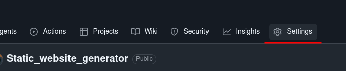

## Static website generator

This is python programme that parse markdown files and convert them into a single/multiple page static website. The webpage uses my favourite catppuccin palette. A Generated webpage looks something like this [link](https://hmonwutt.github.io/Static_website_generator/) that can be deployed to github pages.

Nested formatting like this `_**hello**_` does not work right now. You can use the formatting below.

_The following are **block-level formatting** meaning they require **a blank line before and after** so that the parser recognises it as a separate block._

Headings
```
# Page heading

## Sub heading
```

Ordered List
```
1. First item
2. Second item
3. Third item
```

Unordered list
```
- First item
- Second item
- Third item
```

Code snippets
````
```
print("Hello world")
```
````

Quote with no author
```
> quote (no author)
```

Quote with author name
```
> quote
> author
```

_The following in-line formatting can be used within a block and do not require blank lines. They work within a paragraph or a sentence._
```
**bold**
_italic_
[link](url)

```

_1. You can place image files in_ **static/image** 

_2. Create **content** directory by running this command in the terminal._
```
mdkir content
```

_3. Create markdown files in **content** directory. Feel free to create subfolders. The directory should look like this. You can name the subdirectories anything you like but markdown files must be named **index.md**_
```text
content/
├── subdir/
│   └── index.md
└── subdir1/
    └── index.md
```

_4. Create **docs** directory. This is where generated html files will go._
```
mkdir docs
```

_5. Run this command from the root of the project to test the webpage locally. The webpage is available at:_ **http://localhost:8888**
```
./main.sh / static content docs
```

_6. Run this command from the root of the project to build the project._
```
./build.sh "https://<username>.github.io/<repo name>/" static content docs
```

_7. Click **settings** on your repo._

. 

_8. Create github pages by following this guide_[Github pages documentation](https://docs.github.com/en/pages/getting-started-with-github-pages/configuring-a-publishing-source-for-your-github-pages-site). 

_9. Choose **main** branch and use the folder dropdown menu to select **docs** for your publishing source._

~~That's all for now. Hope you gave it a try. Thanks for stopping by ❤️

